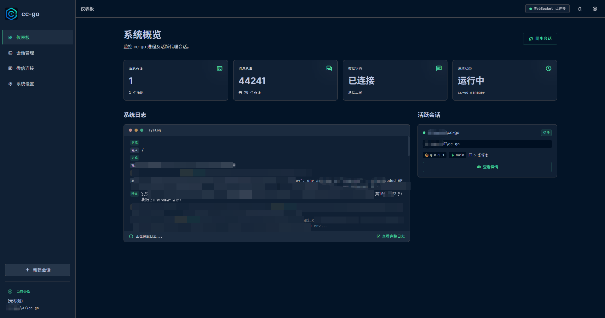

# cc-go

> 通过微信机器人接管 Claude Code，实现随时随地编码。

cc-go 是一款基于 [Claude Code](https://claude.ai/code) 的远程编码工具。通过微信机器人接管 Claude Code 会话，你可以在手机上批准权限请求、查看 AI 回复、启动/切换会话，真正做到随时随地编码。

## 系统架构

```
┌─────────────┐     HTTP/WS      ┌──────────────┐    stdin/stdout    ┌────────────┐
│  微信客户端   │ ◄──────────────► │   cc-go      │ ◄────────────────► │ Claude Code │
│  (手机)      │                  │  (Web + Bot)  │   stream-json     │ (CLI进程)   │
└─────────────┘                  └──────┬───────┘                    └────────────┘
                                        │
                                        ▼
                                 ┌──────────────┐
                                 │  Web 管理界面   │
                                 │  (React + SPA) │
                                 └──────────────┘
```

## 功能特点

- **微信远程控制** — 通过微信消息启动/停止/切换 Claude Code 会话
- **权限审批** — 实时处理 Claude Code 的工具使用权限请求（批准/拒绝/回答提问）
- **Web 管理面板** — 仪表盘、会话列表、实时聊天、日志查看、系统设置
- **会话管理** — 新建/恢复/删除会话，查看对话历史和消息数量
- **Claude 输出推送** — 将 AI 回答、工具调用实时推送到微信
- **WebSocket 实时推送** — 浏览器实时接收会话状态和权限事件

## 界面截图

<!-- TODO: 添加截图 -->
<!--



-->

## 快速开始

### 环境要求

- Go 1.22+
- Node.js 20+
- 已安装并登录 [Claude Code](https://claude.ai/code)
- 拥有 iLink Bot API 访问权限的微信账号

### 构建

```bash
# 安装前端依赖
cd web && npm install

# 构建前端
npm run build

# 构建 Go 二进制文件
cd .. && go build -o cc-go.exe ./cmd/cc-go/
```

### 运行

```bash
# 首次运行（会自动在 ~/.cc-go/config.json 创建默认配置）
./cc-go.exe start

# 服务将在 http://localhost:18080 启动
# 打开浏览器扫描微信二维码并配置 Claude CLI 路径
```

## 配置说明

配置文件路径：`~/.cc-go/config.json`

| 字段 | 类型 | 说明 |
|-------|------|-------------|
| `web_port` | int | Web 服务端口（默认：18080） |
| `permission_mode` | string | Claude Code 权限模式（default/acceptEdits/bypass） |
| `claude_cli_path` | string | Claude CLI 可执行文件路径 |
| `auto_find_claude` | bool | 启动时自动检测 Claude CLI |
| `claude_env_vars` | string | Claude 的额外环境变量（dotenv 格式） |
| `push_types` | string[] | 推送通知类型：permission, claude_response, tool_use, session_status |

### 微信机器人指令

| 指令 | 说明 |
|---------|-------------|
| `/help` | 查看可用指令 |
| `/sessions` | 列出最近会话 |
| `/switch <id>` | 切换会话 |
| `/status` | 查看当前会话状态 |
| `/stop` | 停止当前会话 |
| `/y [数量/all]` | 批准权限请求 |
| `/n [数量/all]` | 拒绝权限请求 |
| `/r <回答>` | 回答 AskUserQuestion 提问 |

## 技术栈

- **后端**: Go, Gin, WebSocket
- **前端**: React 19, TypeScript, Vite, Tailwind CSS 4
- **协议**: Claude Code stream-json（标准输入/输出）
- **微信接入**: iLink Bot API（`ilinkai.weixin.qq.com`）
- **数据存储**: BoltDB（嵌入式键值数据库）